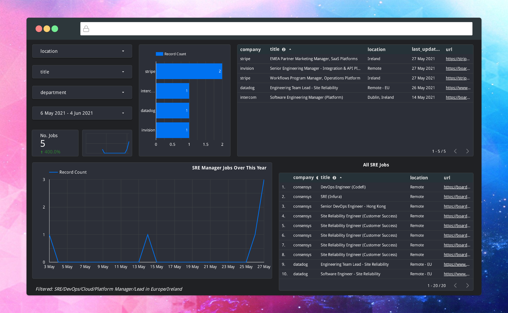

# Jobs2BigQuery

Imports jobs data to a bigquery table in an idempotent fashion.


- [Jobs2BigQuery](#jobs2bigquery)
- [Setting up a bigquery table](#setting-up-a-bigquery-table)
- [Deploying the cloud function](#deploying-the-cloud-function)
- [Sending your first payload](#sending-your-first-payload)
  - [Publish pubub messages](#publish-pubub-messages)
- [Setting up a scheduled run](#setting-up-a-scheduled-run)
- [Data Studio](#data-studio)


# Setting up a bigquery table
I did this through the UI and used the schema in [deploy/bigquery_example_schema.json](deploy/bigquery_example_schema.json). There's probably a much neater way with the `gcloud` CLI but a once-off isn't so bad.

# Deploying the cloud function

The makefile has a `publish` command to create a pubsub topic and deploy the code to a cloud function.

Specify the project ID by prepending the variable before running the command.

```bash
$ PROJECT_ID=<redacted> make publish
poetry export -f requirements.txt --output requirements.txt --without-hashes
gcloud functions deploy Jobs2bigquery --region europe-west1 --project <redacted> --runtime python38 --memory 256MB --entry-point execute_Jobs2bigquery --trigger-topic "trigger-Jobs2bigquery" --timeout 540s --max-instances 1
Deploying function (may take a while - up to 2 minutes)...⠼                                                                                           
For Cloud Build Stackdriver Logs, visit: https://console.cloud.google.com/logs/viewer?<redacted>
Deploying function (may take a while - up to 2 minutes)...done.                                                                                       
availableMemoryMb: 256
buildId: <redacted>
entryPoint: execute_Jobs2bigquery
eventTrigger:
  eventType: google.pubsub.topic.publish
  failurePolicy: {}
  resource: projects/<redacted>/topics/trigger-Jobs2bigquery
  service: pubsub.googleapis.com
ingressSettings: ALLOW_ALL
labels:
  deployment-tool: cli-gcloud
maxInstances: 1
name: projects/<redacted>/locations/europe-west1/functions/Jobs2bigquery
runtime: python38
serviceAccountEmail: <redacted>@appspot.gserviceaccount.com
status: ACTIVE
timeout: 540s
updateTime: '<redacted>'
versionId: '<redacted>'
Published
```

# Sending your first payload

After deployment, you can visit the function in the console and go to the `Testing` tab. There's an example of a payload in [deploy/pubsub_payload.json](deploy/pubsub_payload.json).

## Publish pubub messages

There's a makefile command `add_job` that will add the contents of [deploy/pubsub_payload.json](deploy/pubsub_payload.json) to the pubsub queue which will trigger the cloud function.

```
$ PROJECT_ID=<redacted> make add_job
gcloud pubsub topics publish "projects/<redacted>/topics/trigger-Jobs2bigquery" --message='{     "bq_table_id": "daft_housing_data.sales_data",     "locations": ["ireland"],     "search_type": "property-for-sale",     "max_pages": 25,     "page_offset": 26 }'
messageIds:
- '2027916082568790'
```

# Setting up a scheduled run

Cloud Scheduler is a neat way to automate time-based cloud functions. Use the payload example from above.

# Data Studio

The main downside to my approach is that it produces a large number of duplicated entries, which have to be deduplicated if you want to graph it.

I've used the following connection SQL to take the most recent entry for a listing:

```
SELECT
  * EXCEPT(row_num)
FROM (
  SELECT
    *,
    ROW_NUMBER() OVER (PARTITION BY url ORDER BY logged_at DESC) AS row_num
  FROM
    `jobs.job-listings`)t
WHERE
  row_num=1
```


